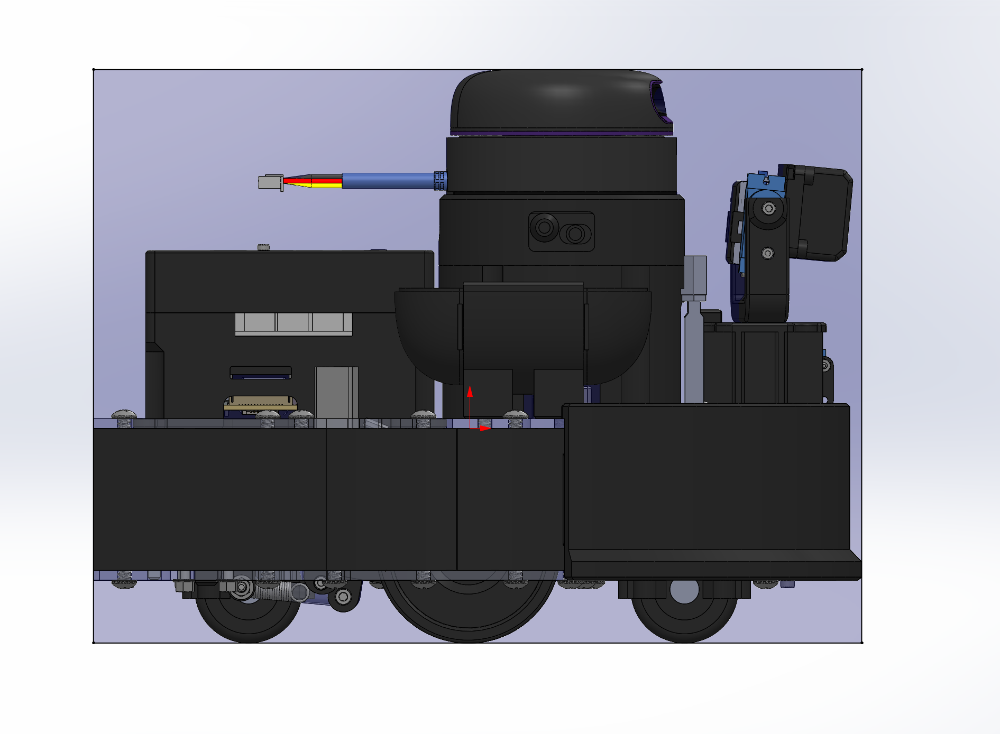
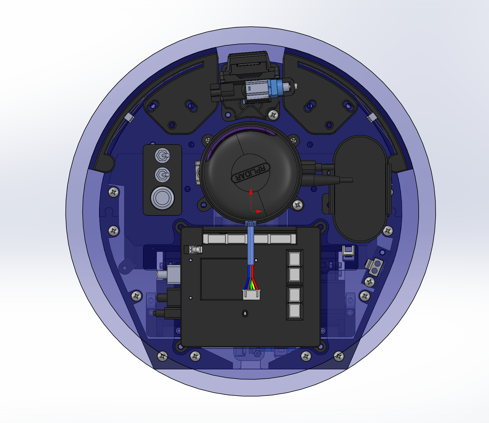
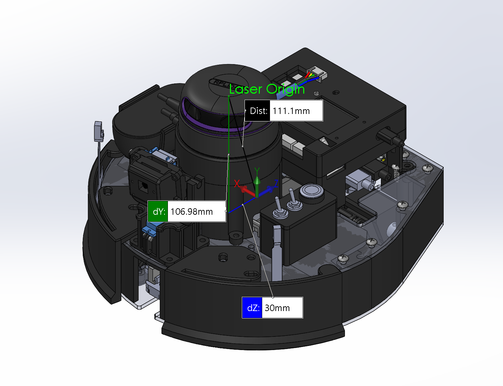
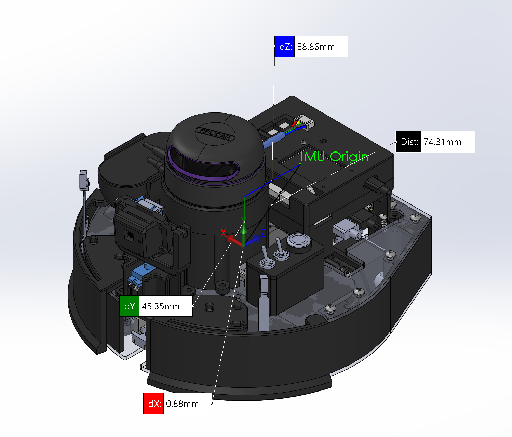
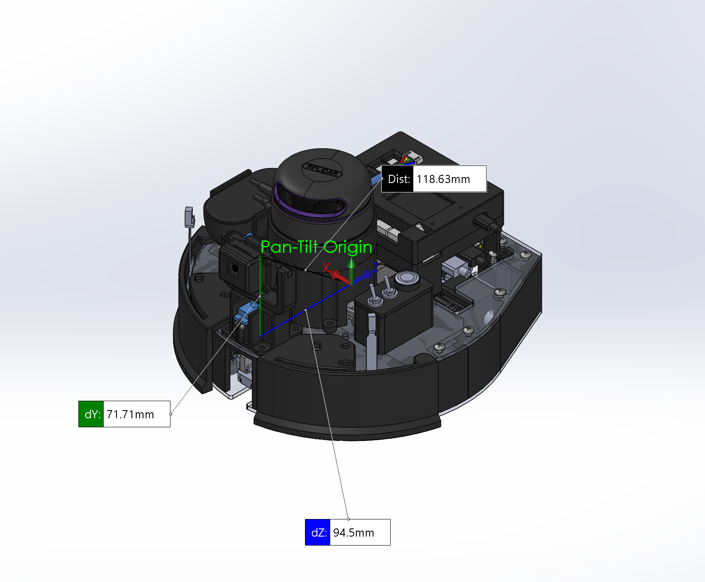
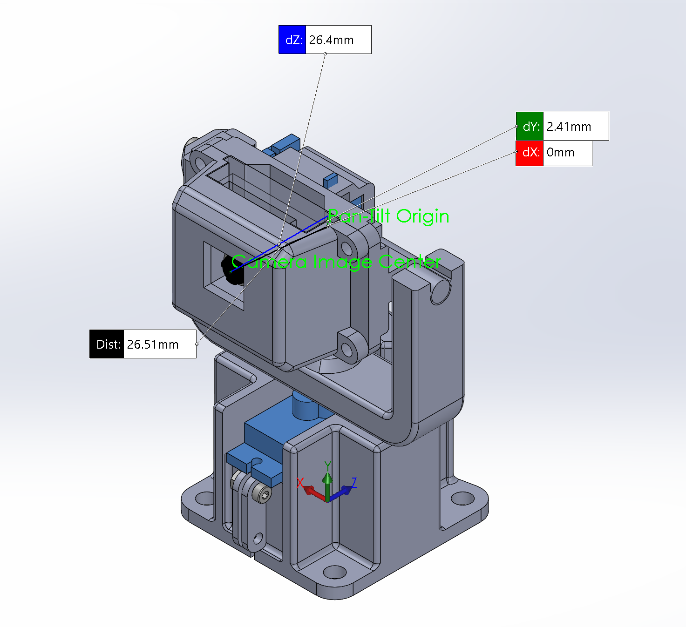
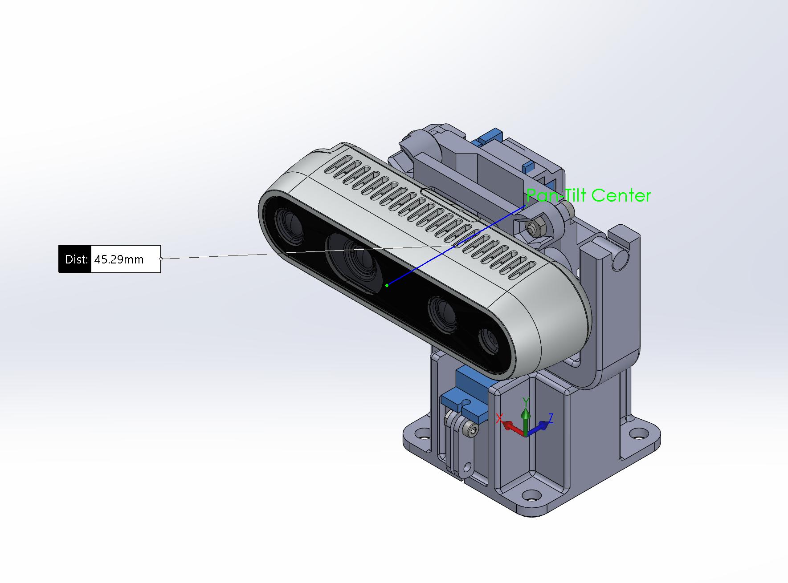

# Robot Measurements

## Overall Dimensions

### Side View
Dimension Name | Measurement (m)
--- | ---
Height  |  0.1869
Length  |  0.25021

### Top View
Dimension Name | Measurement (m)
--- | ---
Minor Diameter  |  0.261
Major Diameter  |  0.28727

## Transforms

The coordinate frame for the Solidworks CAD vs. ROS is different. Here is the mapping:

Solidworks axis | ROS axis
--- | ---
-Z  |  +X
-X  |  +Y
+Y  |  +Z

Transforms will be listed according to the ROS coordinate frame

### Origin to Laser
Axis | Measurement (m)
--- | ---
X  |  0.030
Y  |  0.0
Z  |  0.10698

### Origin to IMU
Axis | Measurement (m)
--- | ---
X  |  -0.05886
Y  |  0.00088
Z  |  0.04535

### Origin to Dual Encoder Midpoint
Axis | Measurement (m)
--- | ---
X  |  -0.0004
Y  |  0.0
Z  |  0.040

### Origin to Camera Pan-Tilt Origin
Axis | Measurement (m)
--- | ---
X  |  0.0945
Y  |  0.0
Z  |  0.07171

### RPi Camera Pan-Tilt Origin to Camera Image Center
Axis | Measurement (m)
--- | ---
X  |  0.0264
Y  |  0.0
Z  |  0.00241

### RealSense D435 Camera Pan-Tilt Origin to Camera Image Center
Axis | Measurement (m)
--- | ---
X  |  0.04529
Y  |  0.0
Z  |  0.0

